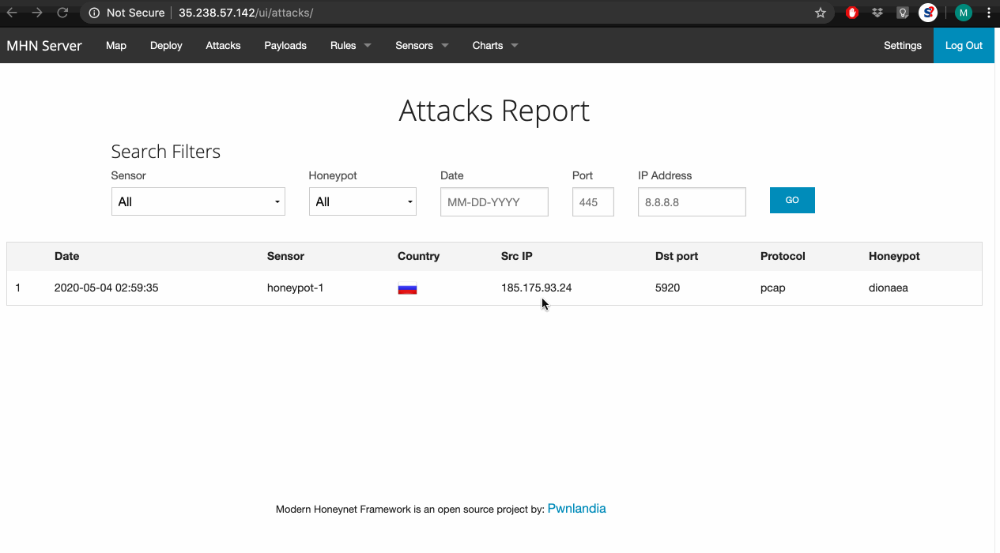

# Project-Honeypot
Weeks 10 &amp; 11 Project: Honeypot

## Honeypot deployed
- Dionaea
## Issues encountered
- Installing MHN since I misread the instructions. 
- Deploying attak with Kali, so i had to unistall and reinstall it so i can use it.
- When running '''nmap -A -T4 35.223.218.108''' I enconter an error as i only got one attack
  and I ran few times but the issue continued. I am not sure why and i will keep debugging. 
## Summary of the data collected:

## Unresolved questions raised by the data collected
N/A
